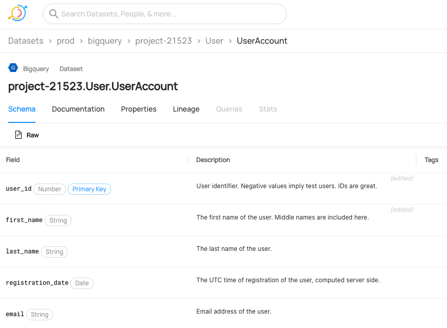

<!-- -->

# DataHub: The Metadata Platform for the Modern Data Stack

### [View all Roadmaps](https://github.com/nholuongut/all-roadmaps) &nbsp;&middot;&nbsp; [Best Practices](https://github.com/nholuongut/all-roadmaps/blob/main/public/best-practices/) &nbsp;&middot;&nbsp; [Questions](https://www.linkedin.com/in/nholuong/)
 

---

[Quickstart](https://datahubproject.io/docs/quickstart) |
[Documentation](https://datahubproject.io/docs/) |
[Features](https://datahubproject.io/docs/features) |
[Roadmap](https://datahubproject.io/docs/roadmap) |
[Adoption](#adoption) |
[Demo](https://datahubproject.io/docs/demo) |
[Town Hall](https://datahubproject.io/docs/townhalls)

---
> 📣 Next DataHub town hall meeting on May 26th, 9am-10am PDT ([convert to your local time](https://greenwichmeantime.com/time/to/pacific-local/))
>
> - Topic Proposals: [submit here](https://docs.google.com/forms/d/1v2ynbAXjJlqY97xE_X1DAntNrXDznOFiNfryUkMPtkI/)
> - Signup to get a calendar invite: [here](https://www.addevent.com/event/zE13785865)
> - Town-hall Zoom link: [zoom.datahubproject.io](https://zoom.datahubproject.io)
> - [Meeting details](docs/townhalls.md) & [past recordings](docs/townhall-history.md)

> ✨ Latest Update:
>
> - Read our Monthly Project Updates [here](https://blog.datahubproject.io/tagged/project-updates).
> - Bringing The Power Of The DataHub Real-Time Metadata Graph To Everyone At Acryl Data: [Data Engineering Podcast](https://www.dataengineeringpodcast.com/acryl-data-datahub-metadata-graph-episode-230/)
> - Unleashing Excellent DataOps with LinkedIn DataHub: [DataOps Unleashed Talk](https://www.youtube.com/watch?v=ccsIKK9nVxk).
> - Latest blog post [DataHub: Popular Metadata Architectures Explained](https://engineering.linkedin.com/blog/2020/datahub-popular-metadata-architectures-explained) @ LinkedIn Engineering Blog.
> - We're on [Slack](docs/slack.md) now! Ask questions and keep up with the latest announcements.

## Introduction

DataHub is an open-source metadata platform for the modern data stack. Read about the architectures of different metadata systems and why DataHub excels [here](https://engineering.linkedin.com/blog/2020/datahub-popular-metadata-architectures-explained). Also read our
[LinkedIn Engineering blog post](https://engineering.linkedin.com/blog/2019/data-hub), check out our [Strata presentation](https://speakerdeck.com/shirshanka/the-evolution-of-metadata-linkedins-journey-strata-nyc-2019) and watch our [Crunch Conference Talk](https://www.youtube.com/watch?v=OB-O0Y6OYDE). You should also visit [DataHub Architecture](docs/architecture/architecture.md) to get a better understanding of how DataHub is implemented.

## Quickstart

Please follow the [DataHub Quickstart Guide](https://datahubproject.io/docs/quickstart) to get a copy of DataHub up & running locally using [Docker](https://docker.com). As the guide assumes some basic knowledge of Docker, we'd recommend you to go through the "Hello World" example of [A Docker Tutorial for Beginners](https://docker-curriculum.com) if Docker is completely foreign to you.

## Development

If you're looking to build & modify datahub please take a look at our [Development Guide](https://datahubproject.io/docs/developers).

## Demo and Screenshots

There's a [hosted demo environment](https://datahubproject.io/docs/demo) where you can play around with DataHub before installing.

## Source Code and Repositories

- [nholuongut/data-hub](https://github.com/nholuongut/data-hub): This repository contains the complete source code for DataHub's metadata model, metadata services, integration connectors and the web application.

## Documentation

We have documentation available at [https://datahubproject.io/docs/](https://datahubproject.io/docs/).

## Releases

See [Releases](https://github.com/nholuongut/data-hub/releases) page for more details. We follow the [SemVer Specification](https://semver.org) when versioning the releases and adopt the [Keep a Changelog convention](https://keepachangelog.com/) for the changelog format.

## Features & Roadmap

Check out DataHub's [Features](docs/features.md) & [Roadmap](https://feature-requests.datahubproject.io/roadmap).

## Contributing

We welcome contributions from the community. Please refer to our [Contributing Guidelines](docs/CONTRIBUTING.md) for more details. We also have a [contrib](contrib) directory for incubating experimental features.

### Extending

If you need to understand how to extend our model with custom types, please see [Extending the Metadata Model](docs/modeling/extending-the-metadata-model.md)

## Community

Join our [slack workspace](https://slack.datahubproject.io) for discussions and important announcements. You can also find out more about our upcoming [town hall meetings](docs/townhalls.md) and view past recordings.

## Adoption

Here are the companies that have officially adopted DataHub. Please feel free to add yours to the list if we missed it.

- [Adevinta](https://www.adevinta.com/)
- [Banksalad](https://www.banksalad.com)
- [Cabify](https://cabify.tech/)
- [DefinedCrowd](http://www.definedcrowd.com)
- [DFDS](https://www.dfds.com/)
- [Expedia Group](http://expedia.com)
- [Experius](https://www.experius.nl)
- [Geotab](https://www.geotab.com)
- [Grofers](https://grofers.com)
- [Haibo Technology](https://www.botech.com.cn)
- [hipages](https://hipages.com.au/)
- [IOMED](https://iomed.health)
- [Klarna](https://www.klarna.com)
- [LinkedIn](http://linkedin.com)
- [Moloco](https://www.moloco.com/en)
- [Peloton](https://www.onepeloton.com)
- [Saxo Bank](https://www.home.saxo)
- [Stash](https://www.stash.com)
- [Shanghai HuaRui Bank](https://www.shrbank.com)
- [ThoughtWorks](https://www.thoughtworks.com)
- [TypeForm](http://typeform.com)
- [Uphold](https://uphold.com)
- [Viasat](https://viasat.com)
- [Wolt](https://wolt.com)
- [Zynga](https://www.zynga.com)

# 🚀 I'm are always open to your feedback.  Please contact as bellow information:
### [Contact ]
* [Name: nho Luong]
* [Skype](luongutnho_skype)
* [Github](https://github.com/nholuongut/)
* [Linkedin](https://www.linkedin.com/in/nholuong/)
* [Email Address](luongutnho@hotmail.com)
* [PayPal.me](https://www.paypal.com/paypalme/nholuongut)

# License
* Nho Luong (c). All Rights Reserved.🌟
